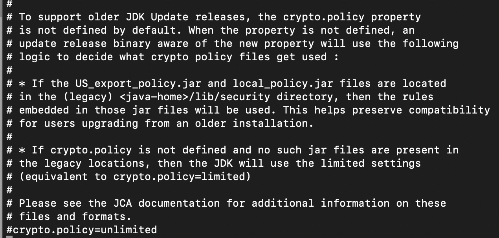

 


# Cryptography

This repository will slowly get more and more cryptography code samples written in Java. 
Methods are related to Cryptography android application cipher method collection. 
Point of this repository is that users can find everything in one place, modify code, play with these methods 
in any way they want and this way learn how ciphers worked in the past and how they work these days.
In short words this repository is meant to be educational.

This repository is part of this Android application: [Google Play - Cryptography](https://play.google.com/store/apps/details?id=com.nitramite.cryptography)

<b>Feel free to contribute or open issues!</b>


Table of contents
=================
* [Ciphers](#ciphers)
* [Hashes](#hashes)
* [Encoding](#encoding)
* [Random](#random)
* [Installation](#installation)
* [Running tests](#running-tests)
    * [Automatically](#automatically)
    * [Manually](#manually)
* [External libraries](#external-libraries)
* [Adding external library](#adding-external-library)
* [Notes](#notes)
* [Troubleshooting](#troubleshooting)
* [Contributions](#contributions)
* [Authors](#authors)
* [Contributors](#contributors)
* [License](#license)


------------------------------------------------------------------------------------------------------------------------


Ciphers
============

##### [Adfgvx](https://github.com/norkator/Cryptography/blob/master/src/cryptography/ciphers/adfgvx/Adfgvx.java)
##### [AES - 128 / 192 / 256](https://github.com/norkator/Cryptography/blob/master/src/cryptography/ciphers/aes/AES.java)
##### [Anubis - 320](https://github.com/norkator/Cryptography/blob/master/src/cryptography/ciphers/anubis/AnubisMethod.java)
##### [ARIA](https://github.com/norkator/Cryptography/blob/master/src/cryptography/ciphers/aria/ARIA.java)
##### [Atbash](https://github.com/norkator/Cryptography/blob/master/src/cryptography/ciphers/atbash/Atbash.java)
##### [Autokey](https://github.com/norkator/Cryptography/blob/master/src/cryptography/ciphers/autokey/Autokey.java)
##### [Bacon](https://github.com/norkator/Cryptography/blob/master/src/cryptography/ciphers/bacon/Bacon.java)
##### [Beaufort](https://github.com/norkator/Cryptography/blob/master/src/cryptography/ciphers/beaufort/Beaufort.java)
##### [Blowfish](https://github.com/norkator/Cryptography/blob/master/src/cryptography/ciphers/blowfish/Blowfish.java)
##### [Caesar](https://github.com/norkator/Cryptography/blob/master/src/cryptography/ciphers/caesar/Caesar.java)
##### [CAST - 5 / 6](https://github.com/norkator/Cryptography/blob/master/src/cryptography/ciphers/cast/CAST.java)
##### [Chaocipher](https://github.com/norkator/Cryptography/blob/master/src/cryptography/ciphers/chaocipher/Chaocipher.java)
##### [Elgamal](https://github.com/norkator/Cryptography/blob/master/src/cryptography/ciphers/elgamal/Elgamal.java)
##### [Gronsfeld](https://github.com/norkator/Cryptography/blob/master/src/cryptography/ciphers/gronsfeld/Gronsfeld.java)
##### [IDEA](https://github.com/norkator/Cryptography/blob/master/src/cryptography/ciphers/idea/IDEA.java)
##### [Keyword](https://github.com/norkator/Cryptography/blob/master/src/cryptography/ciphers/keyword/Keyword.java)
##### [Khazad - 128](https://github.com/norkator/Cryptography/blob/master/src/cryptography/ciphers/khazad/KhazadMethod.java)
##### [Playfair](https://github.com/norkator/Cryptography/blob/master/src/cryptography/ciphers/playfair/Playfair.java)
##### [Porta](https://github.com/norkator/Cryptography/blob/master/src/cryptography/ciphers/porta/Porta.java)
##### [Rail fence](https://github.com/norkator/Cryptography/blob/master/src/cryptography/ciphers/railfence/RailFence.java)
##### [RC - 2 / 4 / 6](https://github.com/norkator/Cryptography/blob/master/src/cryptography/ciphers/rc/RC.java)
##### [Scytale](https://github.com/norkator/Cryptography/blob/master/src/cryptography/ciphers/scytale/Scytale.java)
##### [Vigenere](https://github.com/norkator/Cryptography/blob/master/src/cryptography/ciphers/vigenere/Vigenere.java)


Hashes
============

##### [ADLER - 32](https://github.com/norkator/Cryptography/blob/master/src/cryptography/hashes/adler/Adler.java)
##### [Blake2b - 160 / 256 / 384 / 512](https://github.com/norkator/Cryptography/blob/master/src/cryptography/hashes/blake2b/Blake2b.java)
##### [CRC - 8 / 16 / 24 / 32 / 64](https://github.com/norkator/Cryptography/blob/master/src/cryptography/hashes/crc/CRC.java)
##### [ELF - 32](https://github.com/norkator/Cryptography/blob/master/src/cryptography/hashes/elf/ELF.java)
##### [FCS - 16](https://github.com/norkator/Cryptography/blob/master/src/cryptography/hashes/fcs/FCS.java)
##### [HAS - 160](https://github.com/norkator/Cryptography/blob/master/src/cryptography/hashes/has/HAS.java)
##### [KECCAK - 256 / 384 / 512](https://github.com/norkator/Cryptography/blob/master/src/cryptography/hashes/keccak/Keccak.java)
##### [Kupyna - 256 / 384 / 512](https://github.com/norkator/Cryptography/blob/master/src/cryptography/hashes/kupyna/Kupyna.java)
##### [MD - 2 / 4 / 5](https://github.com/norkator/Cryptography/blob/master/src/cryptography/hashes/md/MD.java)
##### [PBKDF2](https://github.com/norkator/Cryptography/blob/master/src/cryptography/hashes/pbkdf2/PBKDF2.java)
##### [RIPEMD - 128 / 160 / 256 / 320](https://github.com/norkator/Cryptography/blob/master/src/cryptography/hashes/ripemd/RIPEMD.java)
##### [SHA - 0 / 1 / 224 / 256 / 384 / 512](https://github.com/norkator/Cryptography/blob/master/src/cryptography/hashes/sha/SHA.java)
##### [SHA2 - 224 / 256 / 384 / 512](https://github.com/norkator/Cryptography/blob/master/src/cryptography/hashes/sha2/SHA2.java)
##### [SHA3 - 224 / 256 / 384 / 512](https://github.com/norkator/Cryptography/blob/master/src/cryptography/hashes/sha3/SHA3.java)
##### [Skein - 256 / 512 / 1024](https://github.com/norkator/Cryptography/blob/master/src/cryptography/hashes/skein/Skein.java)
##### [SM3](https://github.com/norkator/Cryptography/blob/master/src/cryptography/hashes/sm3/SM3.java)
##### [SUM - 8 / 16 / 24 / 32](https://github.com/norkator/Cryptography/blob/master/src/cryptography/hashes/sum/SUM.java)
##### [TIGER - T / 2 / 128 / 160](https://github.com/norkator/Cryptography/blob/master/src/cryptography/hashes/tiger/Tiger.java)
##### [WHIRLPOOL - 0 / 1 / W](https://github.com/norkator/Cryptography/blob/master/src/cryptography/hashes/whirlpool/Whirlpool.java)
##### [XOR - 8](https://github.com/norkator/Cryptography/blob/master/src/cryptography/hashes/xor/Xor.java)


Encoding
============

##### [A1z26](https://github.com/norkator/Cryptography/blob/master/src/cryptography/encoding/a1z26/A1z26.java)
##### [Adaptive Huffman](https://github.com/norkator/Cryptography/blob/master/src/cryptography/encoding/adaptiveHuffman/AdaptiveHuffman.java)
##### [Base16](https://github.com/norkator/Cryptography/blob/master/src/cryptography/encoding/base16/Base16.java)
##### [Base32](https://github.com/norkator/Cryptography/blob/master/src/cryptography/encoding/base32/Base32.java)
##### [Base64](https://github.com/norkator/Cryptography/blob/master/src/cryptography/encoding/base64/Base64.java)
##### [Base85](https://github.com/norkator/Cryptography/blob/master/src/cryptography/encoding/base85/Base85.java)
##### [Base91](https://github.com/norkator/Cryptography/blob/master/src/cryptography/encoding/base91/Base91.java)
##### [Huffman](https://github.com/norkator/Cryptography/blob/master/src/cryptography/encoding/huffman/Huffman.java)
##### [Morse](https://github.com/norkator/Cryptography/blob/master/src/cryptography/encoding/morse/Morse.java)
##### [RLE](https://github.com/norkator/Cryptography/blob/master/src/cryptography/encoding/rle/Rle.java)


Random
============

##### [Dummy - Bytes](https://github.com/norkator/Cryptography/blob/master/src/cryptography/random/dummy/Dummy.java)
##### [Secure Random - Strong / SHA1PRNG](https://github.com/norkator/Cryptography/blob/master/src/cryptography/random/secureRandom/SecureRandom.java)


<br>

Installation
============
1. Download and install eclipse: https://www.eclipse.org/downloads/
2. Download project source code by either cloning it with Git or by `Clone or download` menu `Download ZIP` option.
2. Open project in Eclipse `File` - `Open projects from File System...`
3. Navigate to `/src` - `cryptography` - `Ciphers.java` and start play with it. Rest of the folder structure
has method specific code and tests files for running automated tests.

I warmly recommend watching basic Eclipse tutorials if you are new to the topic.


Running tests
============

Automatically
--------------
1. Make new branch.
2. Push changes. (tests will be run with each push)
3. Open pull request.
4. Later tests are run by Github Actions workflow (`./.github/workflows/Tests.yml`).

Manually
--------------
1. Right click on `TestRunner.java`
2. Click `Coverage As`
3. Select `1 Java Application`
4. If everything is fine result is `Tests success: true`


External libraries
============

#### commons-codec-1.10.jar
* Included for Base32 and Base64 encoding methods.

#### jacksum-1.7.0 (jacksum.jar)
* Included for many hashing algorithms.
* You can find all source code and details here: https://jacksum.loefflmann.net/en/download.html

#### core-1.58.0.0.jar | prov-1.58.0.0.jar | bcpg-jdk15on-1.58.0.0.jar | bcpkix-jdk15on-1.58.0.0.jar (Spongy Castle)
* Providing tons of newer strong Cryptographic methods. See https://rtyley.github.io/spongycastle/ and http://www.bouncycastle.org/java.html

### bcprov-jdk15on-166
* BouncyCastle signed cryptography provider

#### org.junit_4.13.0.v20200204-1500.jar | core-1.3.0.jar
* JUnit 4 jar and hamcrest core for Github Actions based test runs.


Adding external library
============

Every time new external jar library is added, it must be also added to `build.xml` in a block seen below as example

```xml
<path id="Cryptography.classpath">
    <pathelement location="bin"/>
    <path refid="JUnit 4.libraryclasspath"/>
    <pathelement location="jar/commons-codec-1.10.jar"/>
    <pathelement location="jar/jacksum.jar"/>
    <pathelement location="jar/core-1.58.0.0.jar"/>
    <pathelement location="jar/prov-1.58.0.0.jar"/>
    <pathelement location="jar/bcpkix-jdk15on-1.58.0.0.jar"/>
    <pathelement location="jar/bcpg-jdk15on-1.58.0.0.jar"/>
    <pathelement location="jar/org.junit_4.13.0.v20200204-1500.jar"/>
    <pathelement location="jar/core-1.3.0.jar"/>
    <pathelement location="jar/bcprov-jdk15on-166"/>
</path>
```

Notes
============
Some ciphers or parts of ciphers originate from web sites, tutorials, repositories or other sources. 
There's unfortunately no links to original references.


Troubleshooting
============
Noticed at Mac with jdk1.8.0...  
```shell script
[java.security.InvalidKeyException: Illegal key size or default parameters]>
```
this could be due to crypto policy being limited at java config. To change this, go to:
```shell script
cd /Library/Java/JavaVirtualMachines/jdk1.8.0_152.jdk/Contents/Home/jre/lib/security/
sudo nano java.security
```
and uncomment out `crypto.policy=unlimited`:
 

Following did same trick but from code, so used this one:
```java
import java.security.Security;
public class SomeClass {
	public static void main(String[] args) {
        Security.setProperty("crypto.policy", "unlimited");
    }
}
```

Contributions
============

#### Rules?
* Please, write tests if you make something new.

#### Found problem?
* Open issue or make new branch and create pull request when problem is fixed.

#### Want to optimize code?
* You are free to optimize code, make new branch and create pull request when ready.


Authors
============
* **Norkator** - *Initial work* - [norkator](https://github.com/norkator)


Contributors
============
* **Saurav Kumar** - *Added Morse, Huffman* - [SKR301](https://github.com/SKR301)


License
============
See repo license section or license file.
